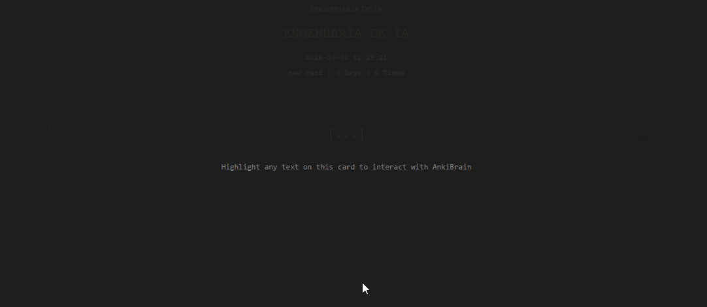

# ⌨️ typingJS

Biblioteca JavaScript leve para simular **digitação com cursor piscando** em elementos do DOM. Ideal para cartões do Anki, apresentações, tutoriais ou qualquer interface em que você queira o efeito de texto sendo digitado em tempo real.

### 🎬 Demonstração



---

## ✨ Características

- **✍️ Cursor piscando** — Cursor animado que acompanha a digitação
- **📐 Preserva HTML** — Respeita tags e estrutura existente (listas, spans, formatação)
- **⏱️ Controle de ritmo** — Velocidade por caractere, atraso inicial e pausas por classe (ex.: `.stop`)
- **📑 Múltiplos containers** — Um ou vários elementos por selector ou referência direta
- **🪶 Sem dependências** — Vanilla JS, funciona em qualquer ambiente com DOM
- **🎯 API simples** — Uma função, um objeto de opções, método `execute()`

---

## 🎴 Origem

O typingJS foi desenvolvido inicialmente para **cartões do Anki**: simular a pergunta sendo digitada e, ao virar o cartão, a resposta com o mesmo efeito. O uso não se limita ao Anki — qualquer página ou aplicação que precise do efeito de typing pode usar a biblioteca.

---

## 📦 Instalação

### Script no HTML

```html
<script src="typing.min.js"></script>
```

Ou use o arquivo não minificado durante o desenvolvimento:

```html
<script src="typing.js"></script>
```

O minificado pode ser gerado com:

```bash
npm run build
```

O arquivo será criado em `dist/typing.min.js`.

### Uso com módulos (Node / bundlers)

```js
const typingJS = require("./typing.js");
// ou, em ambiente ESM com suporte a require
```

No browser, quando carregado por `<script>`, a função fica disponível como `typingJS` no escopo global.

---

## 🚀 Uso rápido

1. **Marque o container** que terá o efeito (por classe ou referência).
2. **Chame `typingJS`** passando as opções.
3. **Chame `execute()`** quando quiser iniciar a animação (por exemplo, no clique de um botão ou ao exibir o cartão).

```html
<div class="container-typing">
  <p>Este texto será exibido como se estivesse sendo digitado.</p>
</div>
<button id="start">Iniciar</button>

<script src="typing.min.js"></script>
<script>
  const instance = typingJS({
    containerSelector: ".container-typing",
    callback: () => console.log("Digitação concluída!"),
  });

  document.getElementById("start").addEventListener("click", () => instance.execute());
</script>
```

---

## 📖 API

### `typingJS(options)`

Configura e retorna a instância. A animação só começa quando `execute()` for chamado.

#### ⚙️ Opções

| Opção | Tipo | Padrão | Descrição |
|-------|------|--------|-----------|
| `containerSelector` | `string` \| `string[]` | `".container-typing"` | Seletor(es) CSS do(s) container(es). |
| `containerReference` | `Element` \| `Element[]` \| `NodeList` | `undefined` | Referência direta ao(s) elemento(s). Útil quando o conteúdo é injetado dinamicamente. |
| `typingSpeedMillisecond` | `number` | `20` | Tempo em ms entre cada caractere. |
| `initialSpeedDelayTime` | `number` | `1000` | Atraso em ms antes de começar a digitar. |
| `typingSpeedDelayClass` | `string` | `"stop"` | Classe que, ao ser encontrada, aplica `typingSpeedDelay` (pausa). |
| `typingSpeedDelay` | `number` | `500` | Tempo em ms de pausa em elementos com a classe acima. |
| `tagNamesToHide` | `string[]` | `["LI"]` | Tags tratadas como “bloco” (ex.: itens de lista) para o efeito. |
| `callback` | `function` | `() => {}` | Função chamada quando a animação termina. |

Pelo menos um de `containerSelector` ou `containerReference` deve resultar em pelo menos um elemento válido; caso contrário, a função lança um erro.

#### ↩️ Retorno

Objeto com um único método:

- **`execute()`** — Inicia a animação. Se já houver uma execução em andamento, emite um aviso no console e não inicia outra.

---

## 💡 Exemplos

### 📑 Múltiplos containers (selector em array)

```js
typingJS({
  containerSelector: [".pergunta", ".resposta"],
  callback: () => console.log("Fim"),
}).execute();
```

### 🎴 Referência direta (útil no Anki)

```js
const card = document.querySelector(".card-content");
typingJS({
  containerReference: card,
  typingSpeedMillisecond: 30,
  initialSpeedDelayTime: 500,
  callback: () => card.classList.add("revealed"),
}).execute();
```

### ⏸️ Pausas com a classe `stop`

Elementos com a classe configurada em `typingSpeedDelayClass` (padrão: `stop`) recebem uma pausa de `typingSpeedDelay` ms antes de continuar — ideal para listas ou parágrafos.

```html
<div class="container-typing">
  <p>Primeira linha.</p>
  <p class="stop">Pausa aqui antes de continuar.</p>
</div>
```

---

## 🏗️ Design e boas práticas na biblioteca

Alguns padrões e decisões de design usados no desenvolvimento do typingJS:

- **🏭 Factory function** — `typingJS(options)` retorna um objeto com `execute`, sem necessidade de `new`. Opções e helpers ficam encapsulados no closure.
- **🔗 Chain of Responsibility** — O fluxo é um pipeline em etapas: criar/obter cursor → aplicar classes nos nós → processar texto (wrap em spans) → animar elementos ocultos. Um objeto de contexto é passado entre as etapas.
- **⏱️ Estratégia para atrasos** — O atraso é calculado por uma lista de regras (primeiro caractere, elemento vazio, classe “stop”, padrão). Facilita adicionar novas regras sem quebrar as existentes.
- **🔒 Lock de execução** — Uma única animação por vez (`typingJS.executing`), evitando sobreposição e comportamento inesperado.
- **🎨 Injeção de estilo idempotente** — O estilo é inserido uma vez (verificação por `#typingStyle`), permitindo múltiplas instâncias sem duplicar CSS.
- **📑 Containers flexíveis** — Aceita seletor (string ou array) ou referência (elemento, array, NodeList), normalizados para uma lista única de elementos.
- **🏷️ Classes com sufixo** — Todas as classes da lib usam o sufixo `-typing` para reduzir conflito com estilos do projeto.
- **🔄 Callback com proxy** — O callback do usuário é envolvido para que o lock (`typingJS.executing`) seja liberado ao final da animação, mesmo se o callback lançar erro.
- **✅ Validação defensiva** — Opções default, merge com o que foi passado e erro claro quando não há container válido.

Essas escolhas ajudam em manutenção, testes e evolução da API sem breaking changes desnecessários.

---

## 🔒 Segurança

⚠️ A biblioteca **não sanitiza** o HTML dos containers. Tags existentes são preservadas no processamento. Use apenas com **conteúdo confiável** (estático ou já sanitizado por você). Se o HTML vier de usuários ou de APIs não confiáveis, faça a sanitização antes de inserir no DOM. Veja mais em `ANALISE-SEGURANCA-E-MELHORIAS.md`.

---

## 🧪 Desenvolvimento

- **Node.js 18+** recomendado para scripts e testes.

```bash
# 📦 Instalar dependências
npm install

# ✅ Rodar testes
npm test

# 👀 Testes em modo watch
npm run test:watch

# 📦 Gerar build minificado (dist/typing.min.js)
npm run build
```

---

## 📄 Licença

**Copyright (c) 2025 Hernandes J. Assis.** Todos os direitos reservados.

**Propriedade:** O código e a documentação deste projeto são de minha propriedade.

**Uso permitido (licença MIT):** Você pode usar, copiar, modificar, mesclar, publicar, distribuir e vender cópias deste software, desde que inclua em todas as cópias o aviso de copyright e este texto de permissão. O software é fornecido “como está”, sem garantias.

Em resumo: você pode utilizar e adaptar livremente, mas a autoria e a propriedade intelectual permanecem comigo.
